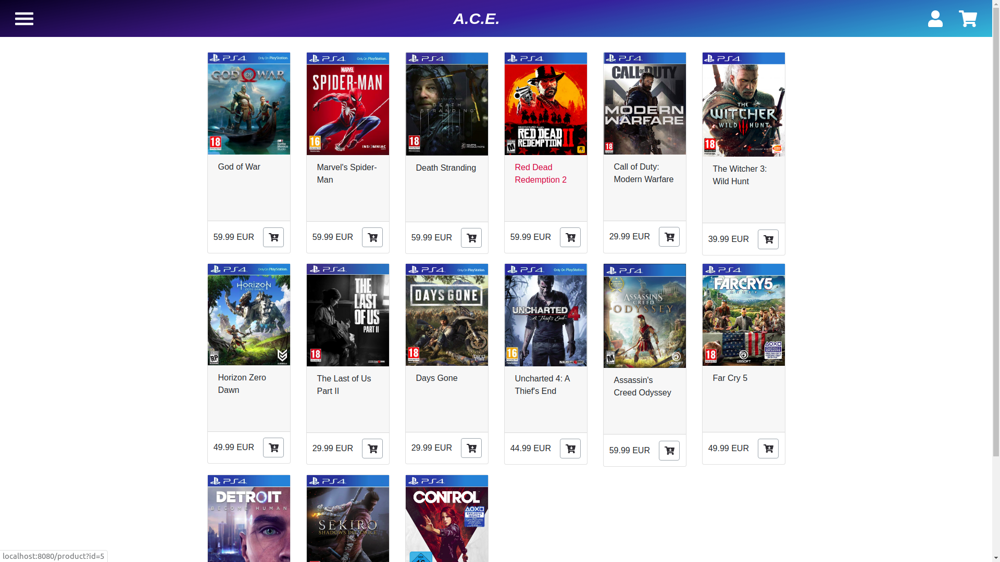
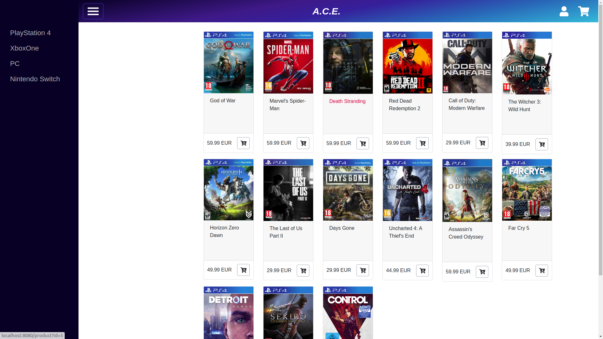
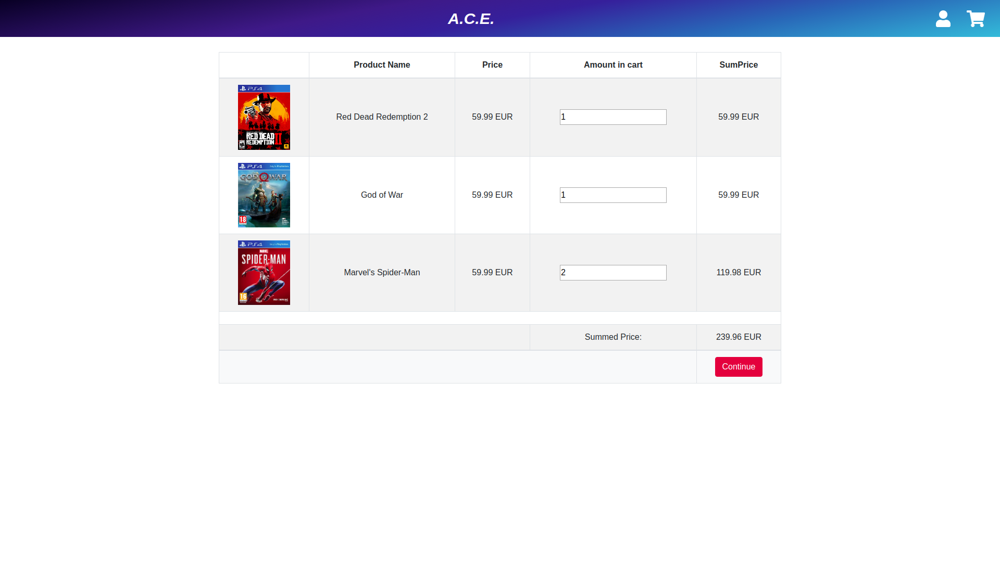

# Codecool Online Shop
####This was a 3 week webshop project we built using:
    Java SE
    Maven
    Java Servlets
    Jetty
    Thymeleaf
    PSQL
    JDBC
    Javascript
    AJAX
    DAO
The webshop sells video games, it has a shopping cart and a checkout view and a fully functional authentication system, that is unfinished on the front-end.

We put a great amount of work into business logic and DAO implementations in Object Oriented Java, while also focusing a lot of our efforts on front-end design, UX and responsiveness, and we gained a lot of experience with asynchronous Javascript and Bootstrap.

